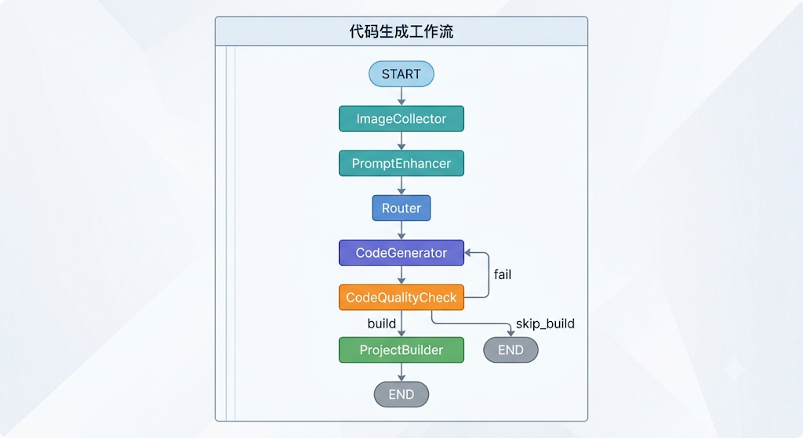
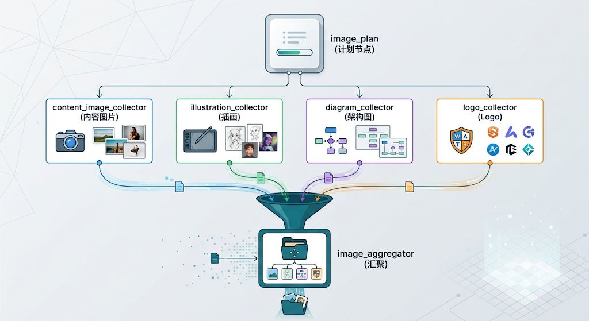
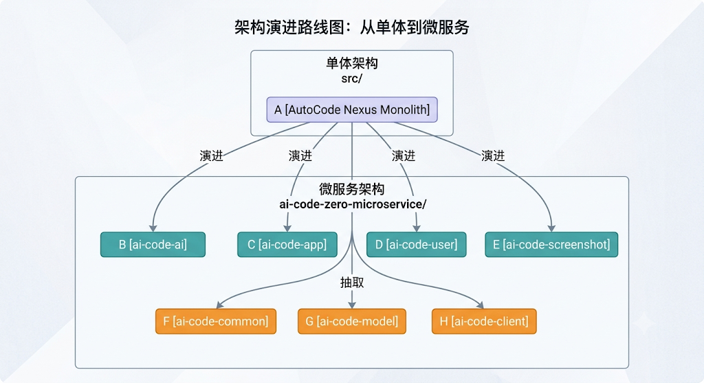
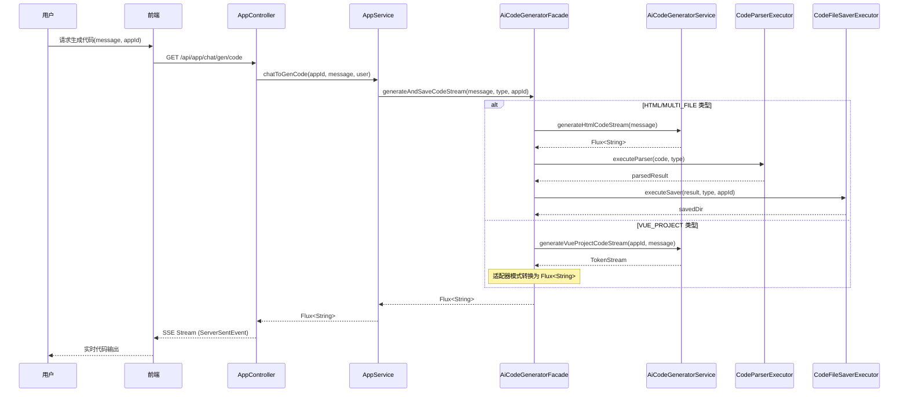
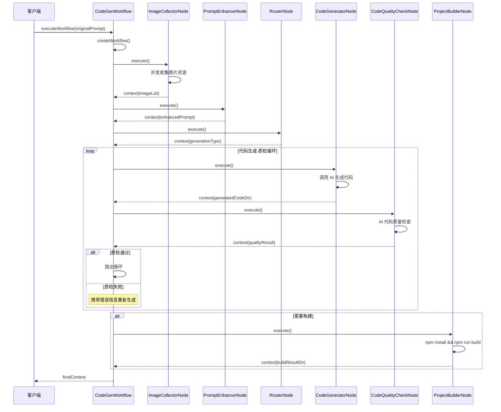

# AutoCode Nexus

> 一个由 LangGraph4j 驱动的 AI 代码生成工作流平台，实现从需求到可部署应用的全链路自动化

[](https://www.oracle.com/java/technologies/downloads/#java21)
[](https://spring.io/projects/spring-boot)
[](https://github.com/langchain4j/langchain4j)
[](https://github.com/besmartr/langgraph4j)
[](https://vuejs.org/)
[](https://vitejs.dev/)

---

## 🎯 项目背景与问题分析

### 痛点一：AI 生成代码质量不可控

直接调用大模型生成代码，往往面临以下问题：
- **语法错误频发**：生成的代码可能存在语法问题，无法直接运行
- **逻辑不完整**：缺少关键的业务逻辑或边界条件处理
- **无法自我修复**：生成失败后只能人工干预，缺乏自动纠错机制
- **缺少质量标准**：没有统一的代码质量检查环节

**我的解决思路**：引入 **AI 代码质量闭环**，将代码生成 → 质量检查 → 自动修复形成循环，通过 LangGraph4j 的条件边实现失败重试，直到代码通过质检或达到最大重试次数。

### 痛点二：生成的项目缺乏完整的视觉呈现

纯文本生成的代码项目，往往存在以下不足：
- **缺少配图资源**：页面内容空洞，只有文字没有视觉元素
- **架构图缺失**：技术展示类项目缺少流程图、架构图
- **Logo 空白**：项目没有品牌标识，完整度不够
- **逐个收集效率低**：手动为每个项目找图耗时耗力

**我的解决思路**：设计 **多源并发图片收集系统**，在代码生成之前，并行收集内容图片、矢量插画、架构图、Logo 等资源，然后将这些资源信息注入到提示词中，让 AI 在生成代码时就把图片引用内置进去。

### 痛点三：流式响应与多类型生成难以统一

不同生成类型的流式响应格式差异大：
- **HTML 生成**：纯文本流，直接拼接
- **多文件生成**：JSON 结构流，需要解析后保存
- **Vue 项目生成**：LangChain4j 的 `TokenStream`，包含工具调用事件
- **前端适配难**：每种格式都要单独处理，代码冗余

**我的解决思路**：采用 **外观模式 + 适配器模式**，对外提供统一的 `Flux<String>` 流式接口，内部将不同类型的流式响应统一转换为 JSON 消息格式，前端只需一套解析逻辑。

### 痛点四：单体架构难以兼顾学习与生产

- **学习场景**：需要单体应用，一键启动，方便理解整体流程
- **生产场景**：需要微服务架构，各模块独立部署、弹性伸缩
- **渐进式演进**：如何从单体平滑过渡到微服务

**我的解决思路**：同一项目同时提供 **单体版本**（`src/`）和 **微服务版本**（`ai-code-zero-microservice/`），通过抽取公共模块（`ai-code-common`、`ai-code-model`、`ai-code-client`）实现代码复用，既保留了学习的便利性，又具备生产部署的能力。

---

## 🏗️ 核心架构设计

### 1. LangGraph4j 工作流编排

**工作流节点设计：**



**设计亮点：**

| 设计决策 | 解决的问题 |
|---------|-----------|
| **节点化拆分** | 每个节点职责单一，便于独立调试和替换 |
| **条件边路由** | 根据质检结果动态决定下一步（通过/失败重试/跳过构建） |
| **上下文传递** | `WorkflowContext` 统一管理工作流状态，节点间数据解耦 |
| **并发分支** | 图片收集阶段并行执行，缩短整体响应时间 |

**核心节点职责：**
- **ImageCollectorNode**：并发收集内容图片、插画、架构图、Logo 资源
- **PromptEnhancerNode**：基于收集的资源增强原始提示词
- **RouterNode**：智能路由到对应的代码生成器
- **CodeGeneratorNode**：调用 AI 生成代码并保存
- **CodeQualityCheckNode**：AI 驱动的代码质量检查
- **ProjectBuilderNode**：Vue 项目构建与打包

### 2. 并发图片收集架构

采用 **扇出-汇聚（Fan-out/Fan-in）** 模式：



**技术实现：**
- 使用 LangGraph4j 的 `RunnableConfig` 配置并行节点执行器
- 自定义线程池（核心10线程，最大20线程）控制并发度
- 聚合器节点等待所有收集任务完成后统一处理
- 异常隔离：单个图片源失败不影响整体流程

### 3. 代码质量闭环机制

**质检流程：**
1. 遍历生成目录下所有代码文件（`.html`, `.css`, `.js`, `.vue`, `.ts`）
2. 按文件路径和内容拼接成结构化的检查输入
3. 调用 AI 进行多维度质量分析（语法、规范、逻辑、安全）
4. 根据质检结果自动路由：
   - ✅ 通过 → 继续构建或结束
   - ❌ 失败 → 携带错误信息重新生成

**关键设计：**
- 智能跳过 `node_modules`、`dist`、`.git` 等目录
- 异常兜底：质检服务异常时默认通过，避免阻塞主流程
- 错误信息回传：将 AI 给出的修复建议注入下一轮生成的提示词

### 4. 单体与微服务双架构设计

**项目架构演进：**



**微服务模块职责：**

| 模块 | 职责 | 说明 |
|------|------|------|
| `ai-code-ai` | AI 核心能力层 | LangChain4j 配置、模型服务、工具调用、Guardrail |
| `ai-code-app` | 应用业务层 | 代码生成业务、项目构建、部署管理、限流缓存 |
| `ai-code-user` | 用户服务层 | 用户认证、权限管理、用户信息维护 |
| `ai-code-screenshot` | 截图服务层 | 网页截图、预览生成、独立部署 |
| `ai-code-common` | 公共组件层 | 工具类、异常处理、配置、COS 管理 |
| `ai-code-model` | 数据模型层 | 实体类、DTO、VO、枚举 |
| `ai-code-client` | 内部调用层 | 微服务间通信客户端、接口定义 |

**架构设计亮点：**
- **关注点分离**：AI 能力、业务逻辑、基础设施彻底解耦
- **独立扩展**：AI 服务可独立扩容应对高并发生成请求
- **故障隔离**：截图服务异常不影响代码生成主流程
- **渐进式演进**：保留单体版本，便于学习和小型部署

---

## ✨ 核心功能亮点

### 1. 智能代码生成引擎

**支持三种生成模式：**
- **HTML 代码生成**：快速生成单页面 HTML 代码
- **多文件代码生成**：生成 HTML/CSS/JS 分离的项目结构
- **Vue 项目生成**：完整的 Vue3 + TypeScript 项目骨架

**技术实现亮点：**
- 使用 `LangChain4j` 的声明式 AI Service 定义，通过 `@SystemMessage` 注解注入系统提示词
- 工厂模式 `AiCodeGeneratorServiceFactory` 根据类型动态选择生成器
- 流式响应支持，通过 `TokenStream` 和 `Flux<String>` 实现实时代码输出

### 2. 流式响应与实时交互

**SSE 实时推送架构：**
- 使用 `Flux<ServerSentEvent<String>>` 实现服务端事件推送
- 前端根据事件类型（`data`/`done`）判断生成进度和完成状态
- 支持工具调用信息的实时传递（`ToolRequestMessage`/`ToolExecutedMessage`）

**适配器模式统一流格式：**
- 将 LangChain4j 的 `TokenStream` 适配为通用的 `Flux<String>`
- 统一消息格式：`AiResponseMessage` / `ToolRequestMessage` / `ToolExecutedMessage`
- 前端只需一套解析逻辑，兼容所有生成类型

### 3. 企业级后端工程实践

**权限控制：**
- `@AuthCheck` 注解 + AOP 拦截器实现细粒度角色校验
- 支持管理员、普通用户等多级角色
- 应用级权限校验：仅本人可操作自己的应用

**请求限流：**
- `@RateLimit` 注解 + Redisson 分布式限流
- 支持按用户、按 IP 等多种限流维度
- 可配置限流频次和时间窗口

**缓存优化：**
- `@Cacheable` 注解实现热点数据缓存
- 精选应用列表、用户信息等高频访问数据缓存到 Redis
- 自定义 `RedisCacheManagerConfig` 配置不同缓存的过期时间

**统一异常处理：**
- `GlobalExceptionHandler` 全局异常拦截
- 自定义 `BusinessException` + 错误码 `ErrorCode`
- `ThrowUtils.throwIf()` 统一参数校验入口，简化判空逻辑

---

## 🛠️ 全栈技术栈总览

**Backend:**
- **框架**: Spring Boot 3.2.x
- **语言**: Java 21 (LTS)
- **AI 框架**: LangChain4j 0.34 + LangGraph4j 0.13
- **工作流**: LangGraph4j 状态图编排
- **ORM**: MyBatis Flex
- **数据库**: MySQL 8.0 + Redis 7.0
- **缓存**: Spring Cache + Redis
- **限流**: Redisson Rate Limiter
- **分布式锁**: Redisson
- **对象存储**: 腾讯云 COS

**Frontend:**
- **框架**: Vue 3.5 + TypeScript
- **构建工具**: Vite 7.0
- **UI 组件**: Ant Design Vue 4.2
- **状态管理**: Pinia
- **路由**: Vue Router 4.5
- **代码高亮**: highlight.js
- **HTTP**: Axios

**监控与 DevOps:**
- **指标采集**: Prometheus
- **可视化**: Grafana
- **API 文档**: Knife4j

---

## 📡 核心业务流程设计

### 流程一：AI 代码生成主流程



### 流程二：LangGraph4j 工作流执行



---

## 🚀 快速本地运行

### 环境准备

1. **JDK 21** - [下载](https://www.oracle.com/java/technologies/downloads/#java21)
2. **MySQL 8.0+** - 创建数据库 `ai_code_zero`
3. **Redis 7.0+** - 启用默认配置
4. **Node.js 22+** - 前端构建依赖

### 配置步骤

**1. 数据库初始化**
```sql
CREATE DATABASE IF NOT EXISTS ai_code_zero DEFAULT CHARACTER SET utf8mb4 COLLATE utf8mb4_unicode_ci;
```

**2. 修改配置文件**

编辑 `src/main/resources/application.yml`：
```yaml
spring:
  datasource:
    url: jdbc:mysql://localhost:3306/ai_code_zero
    username: root
    password: your_password
  data:
    redis:
      host: localhost
      port: 6379
```

**3. 启动后端服务**
```bash
cd ai-code-zero
mvn spring-boot:run
```

**4. 启动前端服务**
```bash
cd ai-code-frontend
npm install
npm run dev
```

### 访问地址

- **前端**: http://localhost:5173
- **后端 API**: http://localhost:8123/api
- **API 文档**: http://localhost:8123/api/doc.html

---

## 🌟 项目亮点总结

### 技术含金量

- ✅ **LangGraph4j 工作流编排**：实现 AI 代码生成的完整生命周期管理，支持条件分支和循环重试
- ✅ **AI 代码质量闭环**：自动质检 + 失败重试机制，确保生成代码的可用性
- ✅ **多模态资源整合**：并发收集图片、插画、架构图、Logo 等资源，提升生成项目的完整度
- ✅ **流式响应设计**：SSE 实时推送 + 适配器模式统一多类型流格式
- ✅ **单体 + 微服务双架构**：同一项目展示两种架构模式，便于学习对比

### 工程实践

- ✅ **注解驱动的权限控制**：`@AuthCheck` AOP 实现细粒度权限校验
- ✅ **分布式限流**：`@RateLimit` + Redisson 实现接口频控
- ✅ **多级缓存策略**：热点数据 Redis 缓存，提升响应速度
- ✅ **统一异常处理**：全局异常拦截 + 自定义错误码 + 工具类判空
- ✅ **设计模式应用**：工厂模式、外观模式、适配器模式、模板方法模式
- ✅ **API 文档自动生成**：Knife4j 集成，接口文档即开即用

### 学习价值

- 🎯 完整的全栈 AI 应用示例，从需求分析到生产部署
- 🎯 企业级后端架构设计，包含权限、限流、缓存、监控
- 🎯 AI Agent 工作流实现，理解 LangGraph4j 的实际应用
- 🎯 从单体到微服务的演进路径，掌握架构拆分方法论
- 🎯 代码质量保障体系建设，AI 自检与自动修复的工程实践

---

如果这个项目对你有帮助，请给个支持的 star！谢谢 ⭐️
