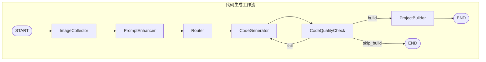
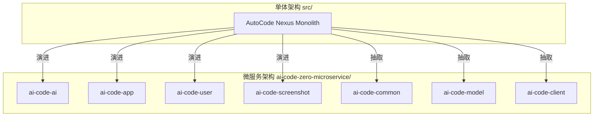
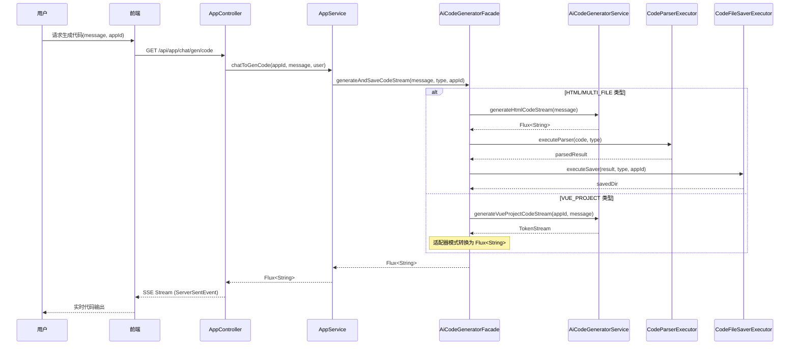
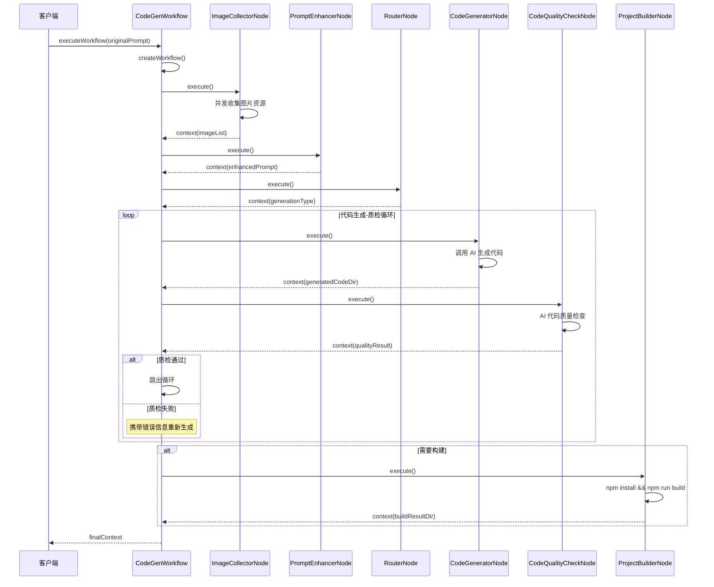

# AutoCode Nexus

> 一个由 LangGraph4j 驱动的 AI 代码生成工作流平台，实现从需求到可部署应用的全链路自动化

[](https://www.oracle.com/java/technologies/downloads/#java21)
[](https://spring.io/projects/spring-boot)
[](https://github.com/langchain4j/langchain4j)
[](https://github.com/besmartr/langgraph4j)
[](https://vuejs.org/)
[](https://vitejs.dev/)

---

## 📦 项目基本信息与痛点分析

### 项目定位

**AI Code Zero** 是一个由 **LangGraph4j** 驱动的 AI 代码生成工作流平台，实现从需求到可部署应用的全链路自动化。

**核心价值：**

1. **解决 AI 代码生成的质量闭环问题**：传统 AI 代码生成工具输出的代码往往存在语法错误、逻辑缺陷，本项目通过 **AI 质检 + 自动修复** 机制，确保生成代码的可用性
2. **多模态资源整合**：自动收集和整合图片、图标、架构图等资源，让生成的项目直接具备完整的视觉呈现能力
3. **全链路自动化**：从用户输入需求描述，到代码生成、质量检查、项目构建，形成完整的自动化工作流
4. **单体 + 微服务双架构支持**：项目同时提供单体应用（`src/`）和微服务拆分版本（`ai-code-zero-microservice/`），便于学习和生产部署

**适合学习场景：**
- ✅ 想学习如何将 AI 能力集成到企业级后端系统
- ✅ 想了解 LangChain4j/LangGraph4j 在实际项目中的应用
- ✅ 想掌握单体应用到微服务架构的演进思路
- ✅ 想参考完整的全栈 AI 应用项目结构

### 核心应用场景

| 场景 | 描述 |
|------|------|
| **快速原型开发** | 输入需求描述，一键生成可运行的 Vue 项目 |
| **前端页面生成** | 根据业务描述生成 HTML/CSS/JS 代码 |
| **多文件项目构建** | 自动生成完整的多文件项目结构 |
| **代码质量保障** | AI 驱动的代码质量检查与自动修复 |

---

## ✨ 核心功能与亮点

### 1. 智能代码生成引擎

**支持三种生成模式：**
- **HTML 代码生成**：快速生成单页面 HTML 代码
- **多文件代码生成**：生成 HTML/CSS/JS 分离的项目结构
- **Vue 项目生成**：完整的 Vue3 + TypeScript 项目骨架

**技术实现亮点：**
- 使用 `LangChain4j` 的声明式 AI Service 定义，通过 `@SystemMessage` 注解注入系统提示词
- 流式响应支持，通过 `TokenStream` 和 `Flux<String>` 实现实时代码输出
- 适配器模式统一处理不同类型的流式响应，确保前端接收格式一致

### 2. LangGraph4j 工作流编排
 
**工作流节点设计：**
 


**核心节点职责：**
- **ImageCollectorNode**：并发收集内容图片、插画、架构图、Logo 资源
- **PromptEnhancerNode**：基于收集的资源增强原始提示词
- **RouterNode**：智能路由到对应的代码生成器
- **CodeGeneratorNode**：调用 AI 生成代码并保存
- **CodeQualityCheckNode**：AI 驱动的代码质量检查
- **ProjectBuilderNode**：Vue 项目构建与打包

### 3. AI 代码质量闭环

**质检流程：**
1. 遍历生成目录下所有代码文件（`.html`, `.css`, `.js`, `.vue`, `.ts`）
2. 拼接代码内容发送给 AI 进行质量分析
3. 根据质检结果自动路由：
   - ✅ 通过 → 继续构建或结束
   - ❌ 失败 → 携带错误信息重新生成

**质量检查维度：**
- 语法正确性
- 代码规范
- 逻辑完整性
- 安全性检查

### 4. 并发图片资源收集

**多源图片采集策略：**
- **内容图片**：通过搜索 API 获取相关图片资源
- **插画资源**：调用 Undraw API 获取矢量插画
- **架构图**：使用 Mermaid 语法生成流程图
- **Logo**：AI 生成品牌 Logo

**并发优化：**
- 使用 `CompletableFuture.supplyAsync()` 并行执行多个图片收集任务
- 通过 `CompletableFuture.allOf()` 等待所有任务完成
- 异常隔离：单个任务失败不影响其他任务

### 5. 流式响应与实时交互

**SSE 实时推送：**
- 使用 `Flux<ServerSentEvent<String>>` 实现服务端事件推送
- 前端根据事件类型（`data`/`done`）判断生成进度和完成状态
- 支持工具调用信息的实时传递（`ToolRequestMessage`/`ToolExecutedMessage`）

### 6. 单体与微服务双架构设计

**项目架构演进：**



**微服务模块职责：**

| 模块 | 职责 | 说明 |
|------|------|------|
| `ai-code-ai` | AI 核心能力层 | LangChain4j 配置、模型服务、工具调用 |
| `ai-code-app` | 应用业务层 | 代码生成业务、项目构建、部署管理 |
| `ai-code-user` | 用户服务层 | 用户认证、权限管理 |
| `ai-code-screenshot` | 截图服务层 | 网页截图、预览生成 |
| `ai-code-common` | 公共组件层 | 工具类、异常处理、配置 |
| `ai-code-model` | 数据模型层 | 实体类、DTO、VO |
| `ai-code-client` | 内部调用层 | 微服务间通信客户端 |

**架构设计亮点：**
- **关注点分离**：AI 能力、业务逻辑、基础设施解耦
- **独立扩展**：各服务可独立部署、弹性伸缩
- **故障隔离**：单一服务故障不影响整体系统
- **渐进式演进**：保留单体版本，便于学习和小型部署

---

## 🛠️ 全栈技术栈总览

**Backend:**
- **框架**: Spring Boot 3.2.x
- **语言**: Java 21 (LTS)
- **AI 框架**: LangChain4j 0.34 + LangGraph4j 0.13
- **ORM**: MyBatis Flex
- **数据库**: MySQL 8.0 + Redis 7.0
- **缓存**: Spring Cache + Redis
- **限流**: Redisson Rate Limiter

**Frontend:**
- **框架**: Vue 3.5 + TypeScript
- **构建工具**: Vite 7.0
- **UI 组件**: Ant Design Vue 4.2
- **状态管理**: Pinia
- **路由**: Vue Router 4.5
- **代码高亮**: highlight.js

**监控与 DevOps:**
- **指标采集**: Prometheus
- **可视化**: Grafana
- **API 文档**: Knife4j

---

## 📡 核心业务流程设计

### 流程一：AI 代码生成主流程



### 流程二：LangGraph4j 工作流执行
 


---

## 🚀 快速本地运行

### 环境准备

1. **JDK 21** - [下载](https://www.oracle.com/java/technologies/downloads/#java21)
2. **MySQL 8.0+** - 创建数据库 `ai_code_zero`
3. **Redis 7.0+** - 启用默认配置
4. **Node.js 22+** - 前端构建依赖

### 配置步骤

**1. 数据库初始化**
```sql
CREATE DATABASE IF NOT EXISTS ai_code_zero DEFAULT CHARACTER SET utf8mb4 COLLATE utf8mb4_unicode_ci;
```

**2. 修改配置文件**

编辑 `src/main/resources/application.yml`：
```yaml
spring:
  datasource:
    url: jdbc:mysql://localhost:3306/ai_code_zero
    username: root
    password: your_password
  data:
    redis:
      host: localhost
      port: 6379
```

**3. 启动后端服务**
```bash
cd ai-code-zero
mvn spring-boot:run
```

**4. 启动前端服务**
```bash
cd ai-code-frontend
npm install
npm run dev
```

### 访问地址

- **前端**: http://localhost:5173
- **后端 API**: http://localhost:8123/api
- **API 文档**: http://localhost:8123/api/doc.html

---

## 🔒 安全与性能指标

### 安全特性

- **JWT 认证**: 通过拦截器实现无状态用户认证
- **权限控制**: `@AuthCheck` 注解实现细粒度角色校验
- **参数校验**: `ThrowUtils.throwIf()` 统一参数校验入口
- **防注入**: MyBatis Flex 预编译语句自动防 SQL 注入

### 性能优化

- **流式响应**: SSE 实时推送，避免大文件等待
- **Redis 缓存**: 精选应用列表使用 `@Cacheable` 注解缓存
- **请求限流**: `@RateLimit` 注解限制单用户请求频率（5次/分钟）
- **并发处理**: 图片收集使用 `CompletableFuture` 并行执行

---

## 🌟 项目亮点总结

**技术含金量：**
- ✅ **LangGraph4j 工作流编排**：实现 AI 代码生成的完整生命周期管理
- ✅ **AI 代码质量闭环**：自动质检 + 失败重试机制，确保代码可用性
- ✅ **多模态资源整合**：并发收集图片、插画、架构图、Logo 等资源
- ✅ **流式响应设计**：SSE 实时推送，提升用户体验
- ✅ **单体 + 微服务双架构**：同一项目展示两种架构模式，便于学习对比

**工程实践：**
- ✅ **统一异常处理**：全局异常拦截，统一错误响应格式
- ✅ **请求限流**：Redisson 分布式限流，防止接口滥用
- ✅ **Redis 缓存**：热点数据缓存优化，提升响应速度
- ✅ **参数校验**：统一校验入口，保证数据完整性
- ✅ **API 文档**：Knife4j 自动生成接口文档

**学习价值：**
- ✅ 完整的全栈 AI 应用示例
- ✅ 企业级后端架构设计
- ✅ AI Agent 工作流实现
- ✅ 从单体到微服务的演进路径

---

如果这个项目对你有帮助，请给个支持的 star！谢谢 ⭐️
